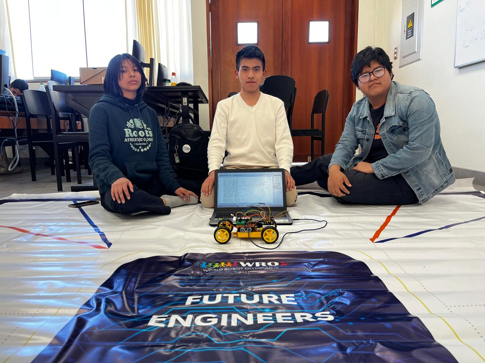
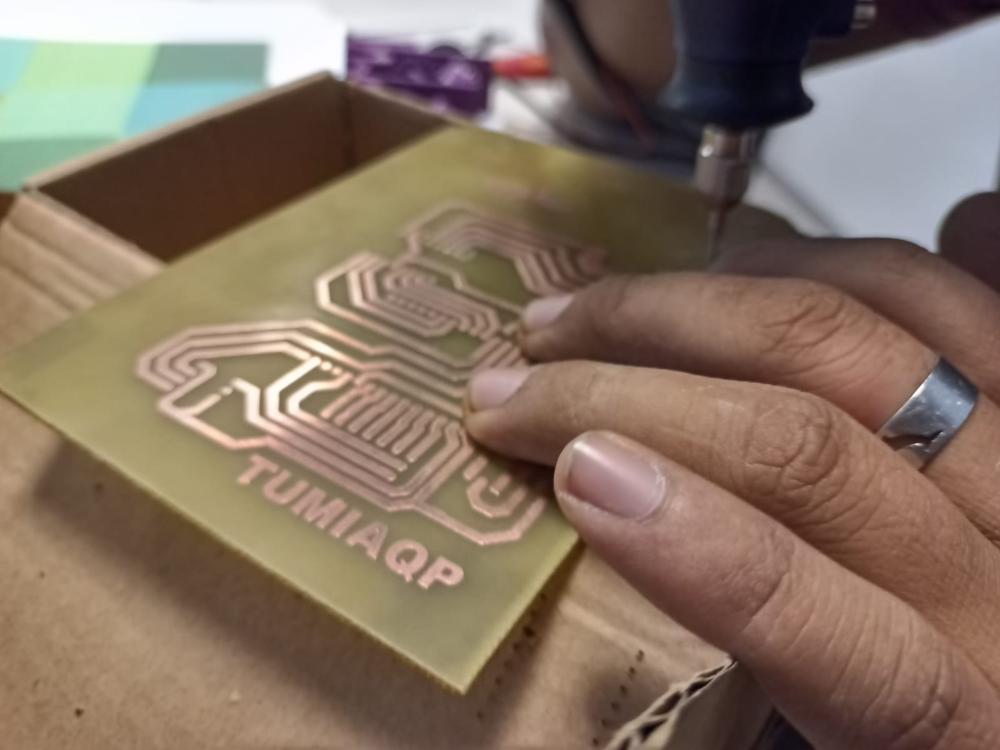
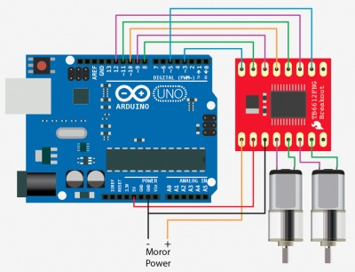
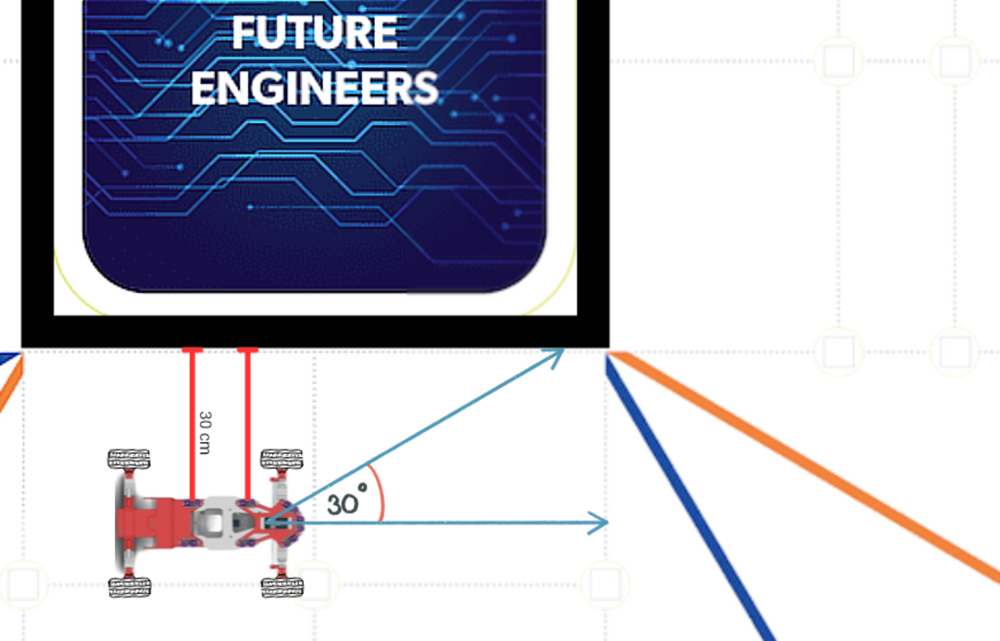
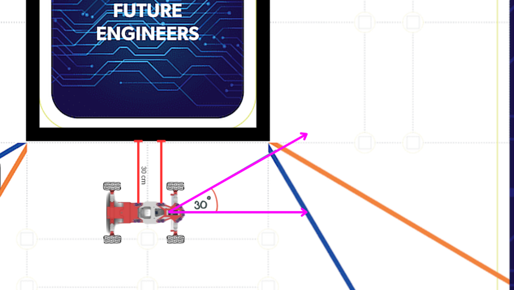
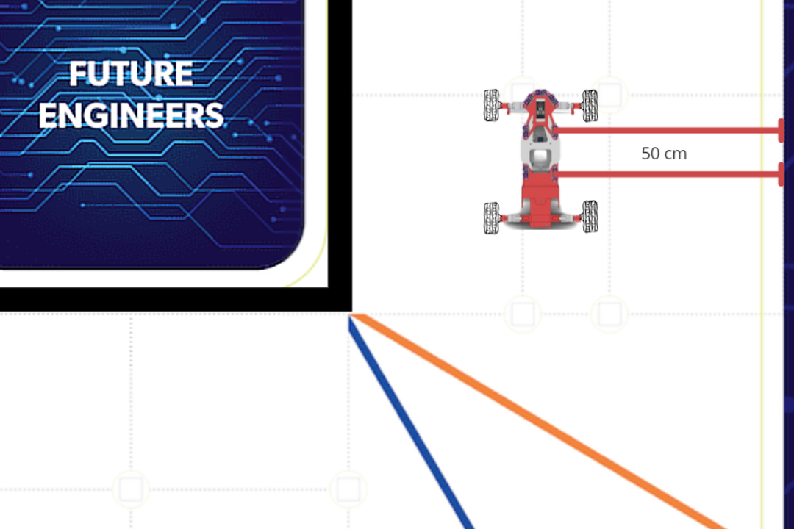
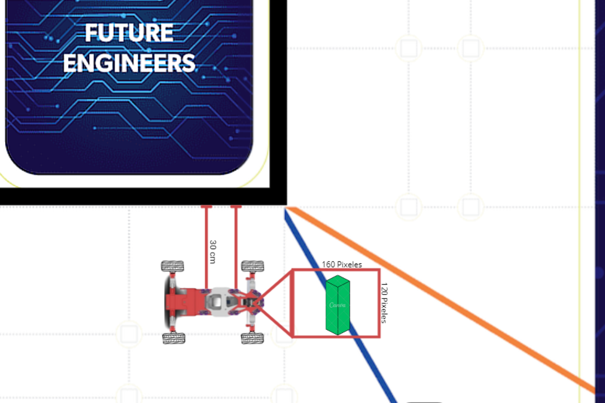

# TUMI-AQP WRO 2024

### TUMI-AQP Repository for WRO 2024 Future Engineers

### Team's Name: ***TumiAQP***
### Car's Name: ***Lujobel***
### Match Name: ***Los Yakus de Cerro Verde***

# 1. WRO 2024 Team - Future Engineers

Welcome to the repository of the **Future Engineers** team for the **WRO 2024**, representing **Arequipa, Peru**! 🇵🇪

## 1.1 About Us

| **Name**                        | **Role**                                     | **Description**                                                              |
|----------------------------------|---------------------------------------------|-------------------------------------------------------------------------------|
| **Joshua Huillca Fuentes**       | **Strategist and Technical Analyst**         | **The strategic brain who always finds the best solution.**                   |
| **Lucy Pérez Casazola**          | **Creative and Technical Designer**          | **The creative mind that brings our innovative designs to life.**             |
| **Gabriel Palomino Mendoza**     | **Electronics, Programming, and Optimization**| **Specialist in electronics and optimization of complex systems.**            |
| **Cristian Villca Balcón**       | **Mentor**                                   | **Robotics expert who guides us with his vast experience.**                   |
| **Bruno Layme Carpio**           | **Mentor**                                   | **System and automation specialist who strengthens our skills.**              |

## 1.2 Our Goal

We work as a team to achieve great things, with the goal of succeeding in the **WRO 2024**. Let’s go all out!

---
> [!NOTE]
> This repository contains all the information related to our project for the WRO 2024, including code, designs, and technical documentation.

## Table of Contents

- [1. 🤖 WRO 2024 Team - Future Engineers](#1-wro-2024-team---future-engineers)
  - [1.1 🌟 About Us](#11-about-us)
  - [1.2 🚀 Our Goal](#12-our-goal)
- [2. 🛠️ Hardware](#2-hardware)
  - [2.1 🔧 Components](#21-components)
    - [2.1.1 ⚡ Power Source](#211-power-source)
    - [2.1.2 🧱 Construction Materials](#212-construction-materials)
    - [2.1.3 🔌 Connectors and Cables](#213-connectors-and-cables)
    - [2.1.4 🛠️ Tools and Adhesives](#214-tools-and-adhesives)
    - [2.1.5 💡 Other Electronic Components](#215-other-electronic-components)
- [4. Models](#3-models)
  - [3.1 PCB Board](#31-pcb-board)
  - [3.2 Ackerman Steering System](#32-ackerman-steering-system)
  - [3.3 Differential System](#33-differential-system)
    - [3.3.1 Motors](#331-Motors)
- [4. TOF System](#4-tof-system)
  - [4.1 First Phase](#41-first-phase)
  - [4.2 Second Phase](#42-second-phase)
  - [4.3 Third Phase](#43-third-phase)
- [5.0 Sensores](#50-sensores)
  - [5.1 TSC3200 color sensor](#51-TSC3200-color-sensor)
  - [5.2 ESP32 CAM](#52-esp32-cam)
  
# 2. Hardware

In this section, we describe the key materials used in the construction of our autonomous vehicle. Each material was carefully selected to ensure maximum precision and reliability during the competition.

## 2.1. Components

### 2.1.1. Power Source

- **11.1V 1500mAh Battery:**  
  Powers all the electronic components, ensuring continuous operation during tests and challenges.

- **LM2596 DC-DC Voltage Converter:**  
  Adjusts the battery voltage to correctly power the different system components.

### 2.1.2. Construction Materials

- **800g of PLA Filament:**  
  Used in the 3D printing of the car structure, providing a lightweight but strong chassis.

- **1 x 10x15cm Copper PCB:**  
  Custom-designed to efficiently connect all electronic components, reducing wiring errors.

### 2.1.3. Connectors and Cables

- **1 x Pack of Female and Male Dupont Cables:**  
  Used to interconnect the electronic components, ensuring firm and secure connections.

- **1 x Pack of 15cm Jumper Cables (Female-Female, Male-Male, Female-Male):**  
  Provides flexibility in the circuit configuration.

- **1 x Pack of M3 Screws (100 pieces, Female and Male):**  
  Used to secure all parts and components in place.

### 2.1.4. Tools and Adhesives

- **1 x Soldering Kit (30W Soldering Iron, Solder):**  
  Essential for making permanent connections and ensuring circuit integrity.

- **2 x Glue Tubes (Triz) and 1 x 100g of Baking Soda:**  
  Used to secure small parts and make quick repairs.

### 2.1.5. Other Electronic Components

- **1 x Two-Position Slide Switch:**  
  Used to safely turn the system on and off.

### Power management

| **Component**            | **Power Consumption**                        | **Source**                                                      |
|--------------------------|----------------------------------------------|-----------------------------------------------------------------|
| **ESP32 WROOM-32**        | ~160 mA during operation                     | [ESP32 Datasheet](https://www.espressif.com/sites/default/files/documentation/esp32_datasheet_en.pdf) |
| **TCS3200 Color Sensor**  | ~2.5 mA during operation                     | [TCS3200 Datasheet](https://www.alldatasheet.com/datasheet-pdf/pdf/560507/AMSCO/TCS3200.html) |
| **2x N20 800RPM Motors**  | ~50 mA per motor no load; max. 200 mA per motor | [N20 Motor 800RPM Datasheet](https://naylampmechatronics.com/motores-dc/278-micromotor-dc-n20-12v-1000rpm.html) |
| **Driver H-Bridge TB6612FNG** | ~1.2 mA no load                        | [TB6612FNG Datasheet](https://www.sparkfun.com/datasheets/Robotics/TB6612FNG.pdf) |
| **7x TOF VL53L0X Sensors**| ~19 mA per sensor (~133 mA total)            | [VL53L0X Datasheet](https://www.st.com/resource/en/datasheet/vl53l0x.pdf) |
| **MG995 Servo**           | ~500 mA no load; up to 1.5 A at full load    | [MG995 Servo Datasheet](https://www.electronicoscaldas.com/datasheet/MG995_Tower-Pro.pdf) |
| **ESP32-CAM**             | ~160 mA during operation                     | [ESP32-CAM Datasheet](https://loboris.eu/ESP32/ESP32-CAM%20Product%20Specification.pdf) |
| **MPU6050 Gyroscope**     | ~3.9 mA during operation                     | [MPU6050 Datasheet](https://invensense.tdk.com/products/motion-tracking/6-axis/mpu-6050/) |
| **Estimated Total**       | **~1.36 A (without full load on servo and motors)** |                                                                 |
| **Maximum Estimated Total** | **Up to ~1.9 A** (with servo and motors at full load) |                                                                 |

# 3. Models

We developed 3D models of the car to simulate its behavior and performance under various conditions. These models helped refine the design before actual production, saving both time and resources.

In this section, you can explore a variety of custom 3D models and 3D-printed parts created for our project. Each model has been crafted with attention to detail, ensuring compatibility with competition standards.

> [!TIP]
> You can find the design files for the 3D-printed parts in the folder [/V-PHOTOS/SECOND-PROTOTYPE/OTHER-PHOTOS/MODELS-3D](V-PHOTOS/SECOND-PROTOTYPE/OTHER-PHOTOS/ROBOT-3D/MODELS-3D) of the repository.

## 3.1 PCB Board  

We designed a PCB to consolidate all the electronic components of the autonomous robot into a compact and organized structure, minimizing connection errors and improving system efficiency. This board allows us to effectively integrate the ESP32, which processes sensor data and controls the actuators. The 7 TOF VL53L0X sensors measure distances precisely, and the TCS3200 color sensor detects visual signals on the track. Additionally, the MPU6050 gyroscope ensures the robot's stability, while the ESP32 CAM captures images of the environment. The MG995 servo motor, controlled by the H-Bridge TB6612FNG driver, manages steering.

### 3.1.1 PCB board assembly

> [!NOTE]
> You can view the 2D or 3D model of the PCB on Flux (the tool we used for design) at https://www.flux.ai/brunolc/roversa?editor=pcb_2d

## 3.2 Ackerman Steering System

The Ackerman steering system ensures that the front wheels follow different curved paths, optimizing maneuverability and preventing slippage. In the WRO 2024, where the vehicle faces 90° turns, this geometry guarantees precision and stability. The MG995 servo motor, with a torque of 10 kg·cm and an angular precision of 0.2°, controls the Ackerman system by adjusting the wheel angles. Its high torque and precision enable extremely accurate turns, essential for fast and efficient maneuvers in the 90-degree turns we require.

## 3.3 Differential System

In the WRO 2024 Future Engineers challenge, the differential system is crucial for ensuring that the rear wheels rotate at different speeds during turns. When the vehicle takes a curve, the outer wheel travels a greater distance than the inner one, and the differential allows these speed adjustments, improving traction and reducing tire wear. This prevents skidding and helps maintain smooth and controlled movement, essential for the precise routes required in the competition.

### 3.3.1 Motors

El Driver H-Bridge TB6612FNG controlará los Motores NP20 del sistema diferencial, permitiendo gestionar las señales PWM para ajustar la velocidad y dirección de cada rueda de forma precisa. Esto es esencial para lograr giros eficientes y maniobras dinámicas. El TB6612FNG interactúa con los sensores TCS3200 y ESP32 CAM, ajustando el movimiento del vehículo según los colores de la pista o la presencia de obstáculos. Permite invertir la rotación de los motores para cambios rápidos de dirección, mientras su protección contra sobrecalentamiento y sobrecorriente asegura un funcionamiento seguro bajo condiciones exigentes.

# 4. TOF System

## 4.1. First Phase
The front TOF detects obstacles and guides the trajectory at a distance of 30 cm, while two additional specialized TOF sensors, placed at 30° on each side of the vehicle, detect the corners of the center of the track to improve precision in curve detection.

## 4.2. Second Phase  
The front and lateral TOF sensors anticipate corners by detecting changes in distance and angle, generating an activation signal for the precise turning of the vehicle at the right moment, based on the readings from the front lateral TOF sensors at 30°.

## 4.3. Third Phase  
The Ackerman system adjusts the wheel angles to execute smooth and precise turns, using data from the rest of the TOF sensors to ensure the vehicle follows the correct path during curves, maintaining a 50 cm distance from the wall.

### 5.0 Sensors

## 5.1 TCS3200 Color Sensor
In the **WRO Future Engineers** competition, we will use the **TCS3200 color sensor** to identify the vehicle's orientation based on the color lines located at the corners of the track:

- **Orange**: Indicates the vehicle should move in a **clockwise direction**.
- **Blue**: Indicates the vehicle should move in a **counterclockwise direction**.

The **TCS3200** will analyze these colors, allowing the vehicle to adjust its direction accurately and in real time. This detection system will enable us to determine which front TOF sensors will activate to perform strategic turns based on the direction indicated by the track colors. In this way, we can optimize the **navigation algorithms** and ensure efficient maneuvers at each turn.

## 5.2 ESP32 CAM

The integration of the **ESP32 CAM** into the robot's navigation system provides an additional layer of analysis, increasing precision and responsiveness to obstacles. By using computer vision, the robot can not only detect the orientation line colors but also identify the colors of obstacles in advance and plan its maneuver before colliding.

