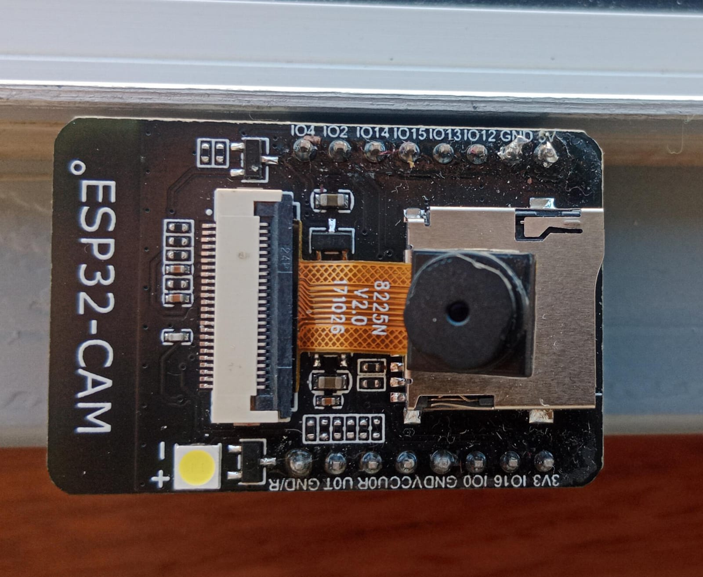
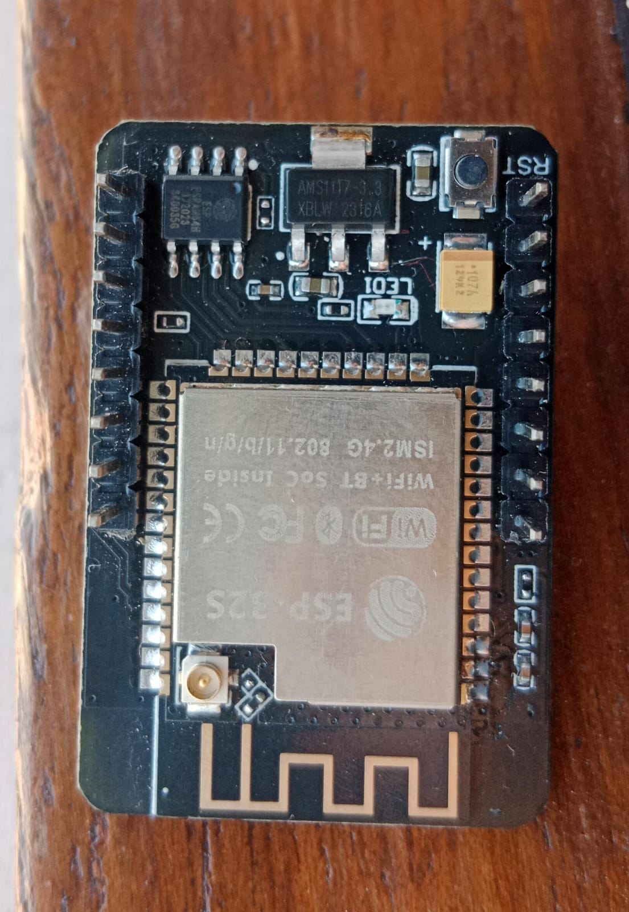
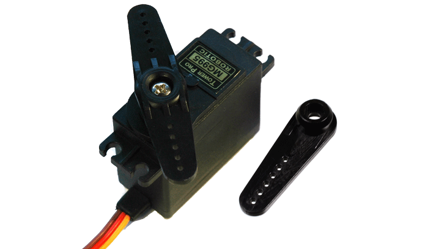
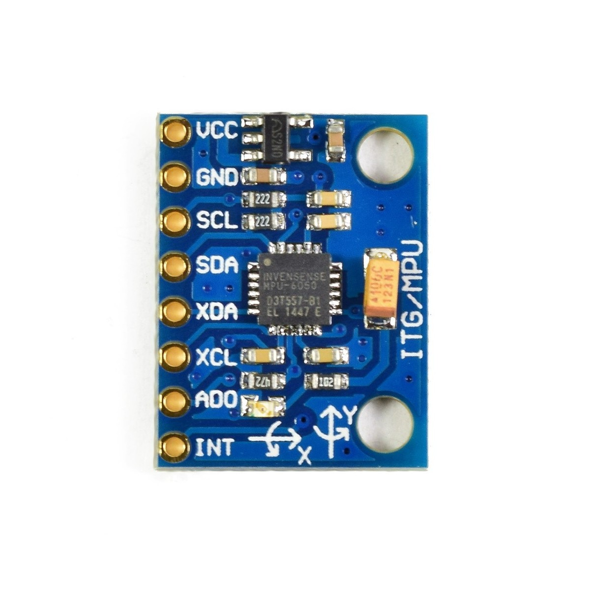
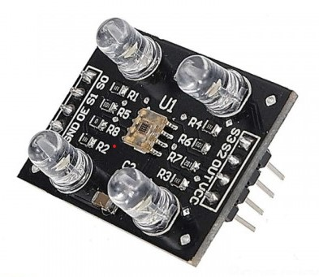

# TUMI-AQP WRO 2024

### TUMI-AQP Repository for WRO 2024 Future Engineers

## Contents

- [Hardware](#hardware)
  - [Components](#components)
  - [Models](#models)
  - [Electronics](#electronics)
  - [Ackerman's](#ackermans)
- [Software](#software)
  - [Sensors](#sensors)
  - [Position](#position)
  - [Strategy](#strategy)
- [Photos](#photos)
  - [Car images](#car-images)
  - [Team images](#team-images)
- [Videos](#videos)
  - [Demonstration videos](#demonstration-videos)
- [Legal](#legal)
  - [License](#license)
  - [Credits](#credits)

## Hardware

Construir un coche autónomo para este desafío implica un proceso meticuloso de reimaginación y rediseño de varios componentes para lograr precisión, seguridad y eficiencia. En este proyecto, nos centramos en mejorar el mecanismo de dirección del coche, diseñar una placa de circuito impreso (PCB) personalizada para conectar todos los componentes de manera fluida, y optimizar la estructura mecánica en general para un mejor rendimiento. Además, utilizamos impresión 3D para crear una estructura robusta y ligera que albergara todos los componentes.

Puedes encontrar los archivos de diseño para las piezas impresas en 3D en la carpeta [V-PHOTOS/SECOND-PROTOTYPE/OTHER-PHOTOS/MODELS-3D) del repositorio.

### Components

In this section, we detail the key components used in the construction of the car, including sensors, actuators, and controllers. Each component was selected to ensure the highest level of accuracy and reliability in autonomous driving.
- 2 N20 Motors 800RPM
- 7 TOF Sensors VL53LOX
- 1 Battery 11.1V 1500mAh
- 1 MPU 6050 Gyroscope
- 2kg PLA Filament
- 1 ESP 32
- 1 ESP 32 CAM and Code Upload Module
- 2 Glues (Triz)
- 1 Sodium Bicarbonate 100g
- 1 Soldering Kit (30W Soldering Iron, Tin)
- 1 Copper PCB Board (10x15 cm)
- 1 H-Bridge Driver (TB6612FNG)
- 1 DC-DC Voltage Converter LM2596
- 1 Package of Female and Male Dupont Wires
- 1 Package of Jumpers (Female-Male, Female-Female, Male-Male) 15cm
- 1 Pack of M3 Screws (100pcs Female and Male)
- 1 Two-Position Slide Switch
- 1 MG90S Servomotor
- 1 TCS3200 Color Sensor interfacing with ESP32
  
We developed 3D models of the car to simulate its behavior and performance under various conditions. These models helped in fine-tuning the design before actual production, saving both time and resources.

### Models
In this section, you can explore a variety of customized 3D models and 3D prints created for our project. Each model has been crafted with attention to detail, ensuring compatibility with the competition's standards.

### Electronics

The electronics system was carefully designed to integrate all sensors and actuators with the central processing unit. We used a custom PCB to streamline connections and reduce the chances of wiring errors, which could lead to system failures.
#### ESP-32

- **Benefits:**  
  The ESP-32 is a powerful microcontroller with Wi-Fi and Bluetooth connectivity, ideal for applications requiring wireless communication. Its low power consumption and processing capabilities make it perfect for automation and remote control projects.

#### ESP32 CAM

- **Benefits:**  
  The ESP32 CAM combines the ESP32's capabilities with an integrated camera, enabling image and video capture. This is especially useful in vision systems for robotics and surveillance projects, providing a cost-effective and compact solution.

#### SERVOMOTOR-MG995

- **Benefits:**  
  The MG995 servomotor is known for its high torque and precision, making it ideal for applications requiring accurate movement control, such as steering in autonomous vehicles or robotic systems.

#### GYROSCOPE-MPU6050

- **Benefits:**  
  The MPU6050 is a motion sensor that combines a gyroscope and an accelerometer. It is crucial for measuring orientation and stability, allowing precise navigation and effective balance control in the vehicle.

#### TOF-VL53LOX

- **Benefits:**  
  The VL53LOX distance sensor uses time-of-flight (ToF) technology to measure distances with high accuracy. It is essential for real-time obstacle detection and environment mapping, enhancing the vehicle's ability to avoid collisions.

#### COLOR SENSOR-TCS3200

- **Benefits:**  
  The TCS3200 is a color sensor that can detect the color and intensity of light. It is useful in applications where color recognition is needed, such as object sorting or signal identification in autonomous systems.

### Ackerman's

We implemented the Ackerman steering principle to ensure that the car's wheels follow the correct path during turns, minimizing tire wear and improving overall handling. This mechanism was fine-tuned to work seamlessly with our control algorithms.

## Software

The software aspect of the project is critical to the car’s ability to navigate autonomously. Our software stack includes modules for sensor data processing, decision-making, and actuation, all running on a real-time operating system to ensure quick and reliable performance.

### Sensors

We employed a variety of sensors, including LiDAR, cameras, and ultrasonic sensors, to gather environmental data. This information is processed in real-time to detect obstacles, determine position, and plan the car's path.

### Position

Accurate positioning is crucial for the car's navigation. We combined GPS data with sensor input to determine the car's exact location, allowing it to navigate complex environments with high precision.

### Strategy

The strategy module is responsible for making high-level decisions, such as path planning and obstacle avoidance. It uses advanced algorithms to calculate the most efficient and safest route to the destination.

## Photos

### Car images

Here are some images of the car at various stages of development and testing, showcasing the design and functionality of the autonomous system.

### Team images

Meet the team behind the TUMI-AQP WRO 2024 project. These images capture the hard work and dedication of our team members as they bring the project to life.

## Videos

### Demonstration videos

Watch our demonstration videos to see the car in action. These videos highlight the car's autonomous capabilities, including obstacle avoidance, path following, and more.

## Legal

### License

This project is licensed under the MIT License, allowing for open-source collaboration and development. Feel free to use and modify our code and designs, but please give credit to the original authors.

### Credits

This project was made possible through the efforts of the TUMI-AQP team, with support from our mentors, sponsors, and the broader community. Special thanks to everyone who contributed to the success of this project.
