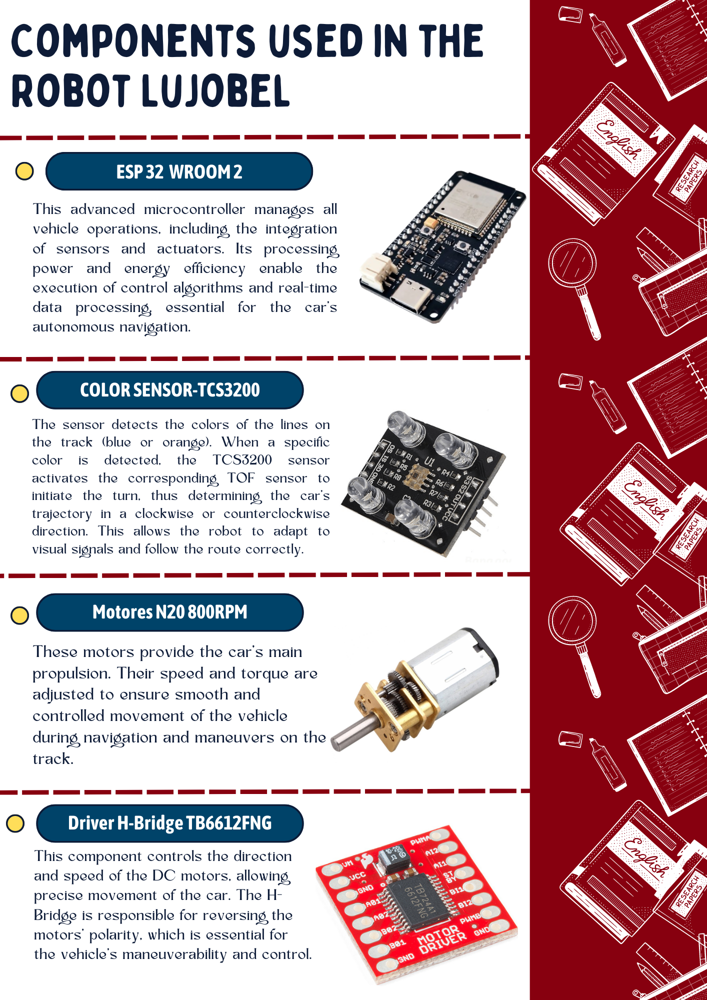
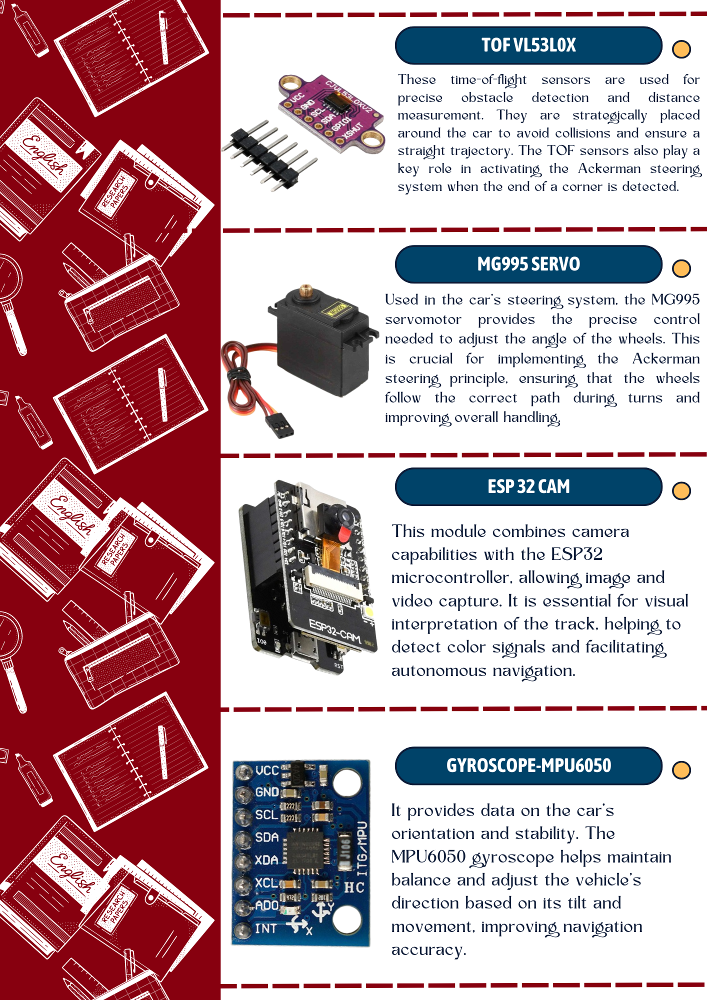
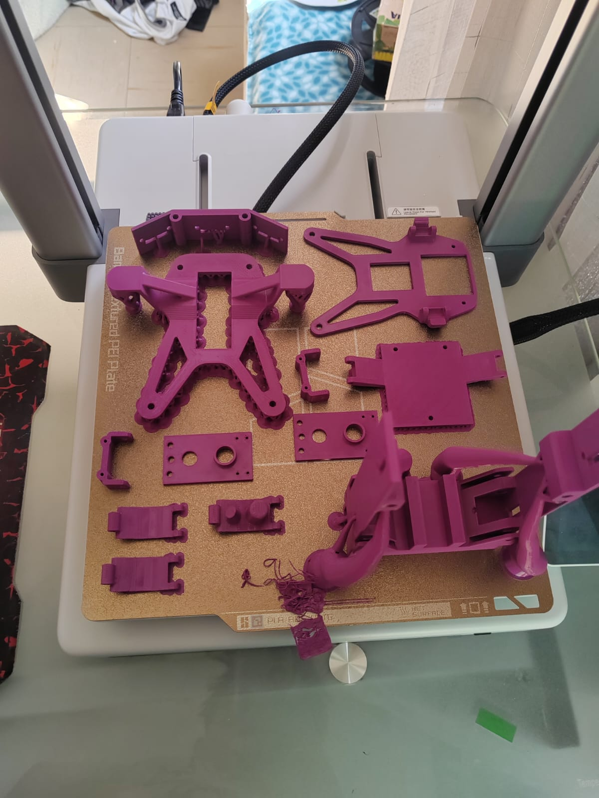
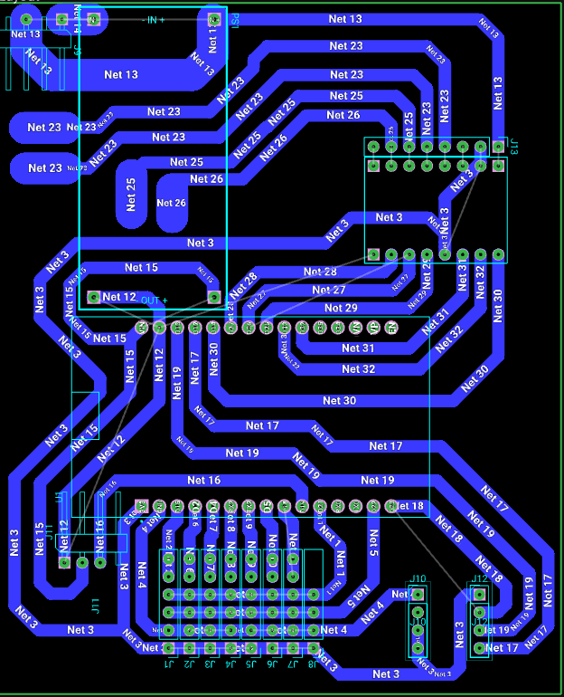
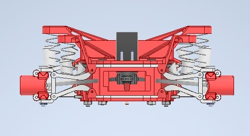
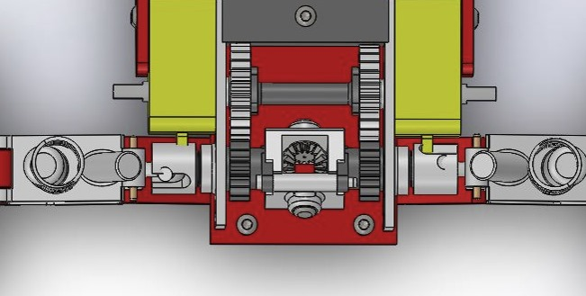

# TUMI-AQP WRO 2024

### TUMI-AQP Repository for WRO 2024 Future Engineers

# 1. 🤖 Equipo WRO 2024 - Futuros Ingenieros

¡Bienvenidos al repositorio del equipo **Futuros Ingenieros** de la **WRO 2024** representando a **Arequipa, Perú**! 🇵🇪

## 1.1 🌟 Sobre Nosotros

| **Nombre**                        | **Rol**                                      | **Descripción**                                                               |
|-----------------------------------|----------------------------------------------|--------------------------------------------------------------------------------|
| **Joshua Huillca Fuentes**        | **Estratega y Analista Técnico**             | **El cerebro estratégico que siempre encuentra la mejor solución.**            |
| **Lucy Pérez Casazola**           | **Creativa y Diseñadora Técnica**            | **La mente creativa que da vida a nuestros diseños innovadores.**              |
| **Gabriel Palomino Mendoza**      | **Electrónica, Programación y Optimización** | **Especialista en electrónica y optimización de sistemas complejos.**          |
| **Cristian Villca Balcón**        | **Mentor**                                   | **Experto en robótica que nos guía con su vasta experiencia.**                 |
| **Bruno Layme Carpio**            | **Mentor**                                   | **Especialista en sistemas y automatización que refuerza nuestras habilidades.**|

## 1.2 🚀 Nuestro Objetivo

Trabajamos en equipo para lograr grandes cosas, con la meta de alcanzar el éxito en la **WRO 2024**. ¡Vamos con todo!

---
> [!NOTE]
> Este repositorio contiene toda la información relacionada con nuestro proyecto en la WRO 2024, incluyendo códigos, diseños y documentación técnica.

## Índice

1. [Equipo WRO 2024 - Futuros Ingenieros](#1-equipo-wro-2024---futuros-ingenieros)
   - [🌟 Sobre Nosotros](#11-🌟-sobre-nosotros)
   - [🚀 Nuestro Objetivo](#12-🚀-nuestro-objetivo)
2. [🛠️ Hardware](#2-🛠️-hardware)
   2.1 [🔧 Componentes](#21-🔧-componentes)
   2.2[⚡ Fuente de Poder](#211-⚡-fuente-de-poder)
   2.3 [🧱 Materiales de Construcción](#212-🧱-materiales-de-construcción)
   2.4 [Conectores y Cables](#24-conectores-y-cables)
   2.5 [🛠️ Herramientas y Adhesivos](#214-🛠️-herramientas-y-adhesivos)
   2.6 [💡 Otros Componentes Electrónicos](#215-💡-otros-componentes-electrónicos)
3. [💻 Modelos](#3-💻-modelos)
   3.1 [📐 Placa PCB](#31-📐-placa-pcb)
   3.2 [🔄 Sistema Ackerman](#32-🔄-sistema-ackerman)
   3.3 [⚙️ Sistema Diferencial](#33-⚙️-sistema-diferencial)

## 2.🛠️ Hardware

En esta sección, describimos los materiales clave utilizados en la construcción de nuestro coche autónomo. Cada material fue cuidadosamente seleccionado para asegurar la máxima precisión y fiabilidad durante la competencia.

## 2.1. 🔧 Componentes

### 2.1.1. ⚡ Fuente de Poder

- ** 11.1V 1500mAh Battery:**  
  Alimenta todos los componentes electrónicos, asegurando operación continua durante las pruebas y desafíos.

- ** LM2596 DC-DC Voltage Converter:**  
  Ajusta el voltaje de la batería para alimentar correctamente los diferentes componentes del sistema.

### 2.1.2. 🧱 Materiales de Construcción

- **800g de Filamento PLA:**  
  Utilizado en la impresión 3D de la estructura del coche, proporcionando un chasis ligero pero fuerte.

- **1 x PCB de Cobre de 10x15cm:**  
  Diseñada a medida para conectar eficientemente todos los componentes electrónicos, reduciendo la posibilidad de errores de cableado.

### 2.1.3. 🔌 Conectores y Cables

- **1 x Paquete de Cables Dupont Hembra y Macho:**  
  Utilizados para interconectar los componentes electrónicos, asegurando conexiones firmes y seguras.

- **1 x Paquete de Cables Jumper de 15cm (Hembra-Hembra, Macho-Macho, Hembra-Macho):**  
  Proporcionan flexibilidad en la configuración del circuito.

- **1 x Paquete de Tornillos M3 (100 piezas, Hembra y Macho):**  
  Utilizados para asegurar todas las piezas y componentes en su lugar.

### 2.1.4. 🛠️ Herramientas y Adhesivos

- **1 x Kit de Soldadura (Soldador de 30W, Estaño):**  
  Esencial para realizar conexiones permanentes y asegurar la integridad del circuito.

- **2 x Tubos de Pegamento (Triz) y 1 x 100g de Bicarbonato de Sodio:**  
  Utilizados para asegurar piezas pequeñas y realizar reparaciones rápidas.

### 2.1.5. 💡 Otros Componentes Electrónicos

- **1 x Interruptor Deslizante de Dos Posiciones:**  
  Utilizado para encender y apagar el sistema de manera segura.

### 3. Modelos

Desarrollamos modelos 3D del coche para simular su comportamiento y rendimiento bajo diversas condiciones. Estos modelos ayudaron a afinar el diseño antes de la producción real, ahorrando tanto tiempo como recursos.

En esta sección, puedes explorar una variedad de modelos 3D personalizados y piezas impresas en 3D creadas para nuestro proyecto. Cada modelo ha sido elaborado con atención al detalle, asegurando la compatibilidad con los estándares de la competencia.

> [!TIP]
> Puedes encontrar los archivos de diseño para las piezas impresas en 3D en la carpeta [/V-PHOTOS/SECOND-PROTOTYPE/OTHER-PHOTOS/MODELS-3D](./V-PHOTOS/SECOND-PROTOTYPE/OTHER-PHOTOS/MODELS-3D) del repositorio.

#### 3.1 PLACA PCB  

Diseñamos una placa PCB para consolidar todos los componentes electrónicos del robot autónomo en una estructura compacta y ordenada, minimizando errores de conexión y mejorando la eficiencia del sistema. Esta placa nos permite integrar de manera efectiva el ESP32, que procesa la información de los sensores y controla los actuadores. Los 7 sensores TOF VL53L0X miden distancias con precisión, y el sensor de color TCS3200 detecta señales visuales en la pista. Además, el giroscopio MPU6050 garantiza la estabilidad del robot, mientras que la ESP32 CAM captura imágenes del entorno. El servomotor MG995, controlado por el driver H-Bridge TB6612FNG.

> [!NOTE]
> Puedes ver el modelo 2D o 3D de la placa en la pagina web de Flux (herramienta que utilizamos para su diseño) https://www.flux.ai/brunolc/roversa?editor=pcb_2d

### 3.2 Sistema Ackerman

La dirección de Ackerman asegura que las ruedas delanteras sigan trayectorias curvas diferentes al girar, con la rueda interna girando en un ángulo mayor que la externa. Este sistema optimiza la maniobrabilidad en curvas cerradas y evita el deslizamiento de las ruedas al forzar menos los neumáticos. En el contexto del WRO2024, donde el vehículo debe seguir trayectorias complejas y realizar giros de 90°, la geometría de Ackerman garantiza que el auto mantenga su precisión y estabilidad durante las maniobras, mejorando el control en circuitos con curvas pronunciadas.

### 3.3 Sistema Diferencial

En el WRO2024 Future Engineers, el sistema diferencial es crucial para garantizar que las ruedas traseras giren a diferentes velocidades durante los giros. Cuando el vehículo toma una curva, la rueda externa recorre una mayor distancia que la interna, y el diferencial permite ajustar estas velocidades, mejorando la tracción y reduciendo el desgaste de los neumáticos. Esto evita deslizamientos y ayuda a mantener un movimiento suave y controlado, fundamental para los recorridos precisos que se requieren en la competencia.

## 2. Strategy

El aspecto del software en el proyecto es fundamental para la capacidad del coche de navegar de forma autónoma. Nuestro stack de software incluye módulos para el procesamiento de datos de sensores, toma de decisiones y actuación, todos ejecutándose en un sistema operativo en tiempo real para asegurar un rendimiento rápido y confiable.

### 2.1. Sensores

Utilizamos una variedad de sensores que son fundamentales para el correcto funcionamiento del coche autónomo en la competencia:

- **7 Sensores TOF VL53LOX:**  
  Utilizados para la detección precisa de obstáculos, estos sensores ayudan a que el coche pueda evitar colisiones y navegar a través de entornos complejos.

- **1 Sensor de Color TCS3200:**  
  Empleado para detectar señales de color en la pista, crucial para la interpretación de marcadores de ruta o zonas específicas.

- **1 Giroscopio MPU6050:**  
  Proporciona información vital sobre la orientación y estabilidad del vehículo, permitiendo ajustes precisos durante la navegación.

### 2.2. Posicionamiento y Estrategia

El posicionamiento preciso es fundamental para que el coche autónomo pueda cumplir con las exigencias de la competencia. Para lograrlo, combinamos los siguientes

