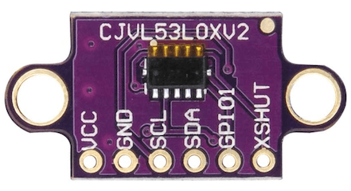

# TUMI-AQP WRO 2024

### TUMI-AQP Repository for WRO 2024 Future Engineers

# 🤖 Equipo WRO 2024 - Futuros Ingenieros

¡Bienvenidos al repositorio del equipo **Futuros Ingenieros** de la **WRO 2024** representando a **Arequipa, Perú**! 🇵🇪

## 🌟 Sobre Nosotros

| **Nombre**                        | **Rol**                                      | **Descripción**                                                               |
|-----------------------------------|----------------------------------------------|--------------------------------------------------------------------------------|
| **Joshua Huillca Fuentes**        | **Estratega y Analista Técnico**             | **El cerebro estratégico que siempre encuentra la mejor solución.**            |
| **Lucy Pérez Casazola**           | **Creativa y Diseñadora Técnica**            | **La mente creativa que da vida a nuestros diseños innovadores.**              |
| **Gabriel Palomino Mendoza**      | **Electrónica, Programación y Optimización** | **Especialista en electrónica y optimización de sistemas complejos.**          |
| **Cristian Villca Balcón**        | **Mentor**                                   | **Experto en robótica que nos guía con su vasta experiencia.**                 |
| **Bruno Layme Carpio**           | **Mentor**                                   | **Especialista en sistemas y automatización que refuerza nuestras habilidades.**|

## 🚀 Nuestro Objetivo

Trabajamos en equipo para lograr grandes cosas, con la meta de alcanzar el éxito en la **WRO 2024**. ¡Vamos con todo!

---

> **Nota:** Este repositorio contiene toda la información relacionada con nuestro proyecto en la WRO 2024, incluyendo códigos, diseños y documentación técnica.

## Contents

- [Hardware](#hardware)
  - [Components](#components)
  - [Models](#models)
  - [Electronics](#electronics)
  - [Ackerman's](#ackermans)
- [Software](#software)
  - [Sensors](#sensors)
  - [Position and Strategy](#position_and_strategy)
### Components

En esta sección, detallamos los componentes clave utilizados en la construcción del coche, incluidos sensores, actuadores y controladores. Cada componente fue seleccionado para asegurar el más alto nivel de precisión y confiabilidad en la conducción autónoma durante la competencia.

#### Motores y Actuadores
- **2 Motores N20 800RPM:** Proporcionan la fuerza motriz necesaria para el movimiento del coche. Estos motores son compactos y potentes, ideales para la maniobrabilidad en la pista de competencia.
- **1 Servomotor MG995:** Utilizado para controlar el sistema de dirección, este servomotor permite giros precisos, siguiendo el principio de dirección de Ackerman.

#### Energía
- **1 Batería de 11.1V 1500mAh:** Proporciona la energía necesaria para todos los componentes electrónicos, garantizando una operación continua durante las pruebas y desafíos.
- **1 Convertidor de Voltaje DC-DC LM2596:** Ajusta el voltaje de la batería para alimentar adecuadamente los diferentes componentes del sistema.

#### Microcontroladores y Comunicación
- **1 ESP 32:** El cerebro del coche autónomo. Este microcontrolador gestiona la lógica de control y la comunicación con los sensores y actuadores.
- **1 ESP 32 CAM y Módulo de Carga de Código:** Añade capacidades de visión al coche, permitiendo la captura de imágenes y videos, lo que puede ser útil para sistemas de visión artificial en la competencia.

#### Materiales de Construcción
- **800 gramos de Filamento PLA:** Utilizado en la impresión 3D de la estructura del coche, proporcionando un chasis ligero pero resistente.
- **1 Placa PCB de Cobre (10x15 cm):** Personalizada para conectar de manera eficiente todos los componentes electrónicos, reduciendo la posibilidad de errores de cableado.

#### Conectores y Cables
- **1 Paquete de Cables Dupont Hembra y Macho:** Utilizados para interconectar los componentes electrónicos, asegurando conexiones firmes y seguras.
- **1 Paquete de Jumpers (Hembra-Macho, Hembra-Hembra, Macho-Macho) 15 cm:** Proporcionan flexibilidad en la configuración de los circuitos.
- **1 Paquete de Tornillos M3 (100 piezas Hembra y Macho):** Para asegurar todas las piezas y componentes en su lugar.

#### Herramientas y Adhesivos
- **1 Kit de Soldadura (Cautín de 30W, Estaño):** Necesario para realizar conexiones permanentes y asegurar la integridad de los circuitos.
- **2 Pegamentos (Triz) y 1 Bicarbonato de Sodio 100g:** Utilizados para asegurar piezas pequeñas y realizar reparaciones rápidas.

#### Otros Componentes Electrónicos
- **1 Driver H-Bridge (TB6612FNG):** Controla la dirección y velocidad de los motores, permitiendo un manejo preciso del coche.
- **1 Interruptor Deslizante de Dos Posiciones:** Utilizado para encender y apagar el sistema de manera segura.

### Models

Desarrollamos modelos 3D del coche para simular su comportamiento y rendimiento bajo diversas condiciones. Estos modelos ayudaron a afinar el diseño antes de la producción real, ahorrando tanto tiempo como recursos.

En esta sección, puedes explorar una variedad de modelos 3D personalizados y piezas impresas en 3D creadas para nuestro proyecto. Cada modelo ha sido elaborado con atención al detalle, asegurando la compatibilidad con los estándares de la competencia.

Puedes encontrar los archivos de diseño para las piezas impresas en 3D en la carpeta [/V-PHOTOS/SECOND-PROTOTYPE/OTHER-PHOTOS/MODELS-3D](./V-PHOTOS/SECOND-PROTOTYPE/OTHER-PHOTOS/MODELS-3D) del repositorio.

### Electronics

El sistema electrónico fue cuidadosamente diseñado para integrar todos los sensores y actuadores con la unidad central de procesamiento. Usamos una PCB personalizada para simplificar las conexiones y reducir las posibilidades de errores de cableado, lo que podría llevar a fallos en el sistema.

#### ESP-32

- **Beneficios:**  
 El ESP-32 es un microcontrolador avanzado que destaca por su potencia de procesamiento y eficiencia energética. Su diseño moderno y de bajo costo lo convierte en una solución ideal para proyectos de automatización y control. Su capacidad para manejar tareas complejas con un bajo consumo energético lo hace especialmente adecuado para aplicaciones que requieren un alto rendimiento sin comprometer el presupuesto.

#### ESP32 CAM

- **Beneficios:**  
  El ESP32 CAM combina las capacidades del ESP32 con una cámara integrada, permitiendo la captura de imágenes y videos. Esto es especialmente útil en sistemas de visión para robótica y proyectos de vigilancia, proporcionando una solución compacta y rentable para la segunda ronda de la competencia en el cual nos apoya detectando los obstaculos y su determinado color (verde o rojo) dirigiendo al robot de manera efectiva.

#### SERVOMOTOR-MG995

- **Beneficios:**  
    El servomotor MG995 es conocido por su alto torque y precisión, lo que lo hace ideal para aplicaciones que requieren un control de movimiento exacto, Perfecto para el sistema direccional utilizado.

#### GYROSCOPE-MPU6050

- **Beneficios:**  
  El MPU6050 es un sensor de movimiento que combina un giroscopio y un acelerómetro. Es crucial para medir la orientación y estabilidad, permitiendo una navegación precisa y un control de balance efectivo en el vehículo.

#### TOF-VL53LOX

- **Beneficios:**  
  El sensor de distancia VL53LOX utiliza tecnología de tiempo de vuelo (ToF) para medir distancias con alta precisión. Es esencial para la detección de obstáculos en tiempo real y el mapeo del de la pista, mejorando la capacidad del vehículo para evitar colisiones.

#### COLOR SENSOR-TCS3200

- **Beneficios:**  
  El TCS3200 es un sensor de color que puede detectar el color y la intensidad de la luz. Es útil en aplicaciones donde se necesita el reconocimiento de colores, como la clasificación de objetos o la identificación de señales en sistemas autónomos.

#### PLACA PCB  

Diseñamos una placa PCB para consolidar todos los componentes electrónicos del robot autónomo en una estructura compacta y ordenada, minimizando errores de conexión y mejorando la eficiencia del sistema. Esta placa nos permite integrar de manera efectiva el ESP32, que procesa la información de los sensores y controla los actuadores. Los 7 sensores TOF VL53L0X miden distancias con precisión, y el sensor de color TCS3200 detecta señales visuales en la pista. Además, el giroscopio MPU6050 garantiza la estabilidad del robot, mientras que la ESP32 CAM captura imágenes del entorno. El servomotor MG995, controlado por el driver H-Bridge TB6612FNG.

### Ackerman's

Implementamos el principio de dirección de Ackerman para asegurar que las ruedas del coche sigan la trayectoria correcta durante los giros, minimizando el desgaste de los neumáticos y mejorando el manejo general. Este mecanismo fue ajustado para trabajar sin problemas con nuestros algoritmos de control.

## Software

El aspecto del software en el proyecto es fundamental para la capacidad del coche de navegar de forma autónoma. Nuestro stack de software incluye módulos para el procesamiento de datos de sensores, toma de decisiones y actuación, todos ejecutándose en un sistema operativo en tiempo real para asegurar un rendimiento rápido y confiable.

### Sensors

Utilizamos una variedad de sensores que son fundamentales para el correcto funcionamiento del coche autónomo en la competencia:

- **7 Sensores TOF VL53LOX:** Utilizados para la detección precisa de obstáculos, estos sensores ayudan a que el coche pueda evitar colisiones y navegar a través de entornos complejos.
- **1 Sensor de Color TCS3200:** Empleado para detectar señales de color en la pista, crucial para la interpretación de marcadores de ruta o zonas específicas.
- **1 Giroscopio MPU 6050:** Proporciona información vital sobre la orientación y estabilidad del vehículo, permitiendo ajustes precisos durante la navegación.

### Position and Strategy

El posicionamiento preciso es fundamental para que el coche autónomo pueda cumplir con las exigencias de la competencia. Para lograrlo, combinamos los siguientes componentes:

- **7 Sensores TOF VL53LOX:** Los sensores TOF están posicionados estratégicamente alrededor del coche para medir la distancia a las paredes y mantener una dirección recta. Cuando uno de los sensores TOF frontales (dependiendo de la dirección inicial tomada al comenzar la ronda) detecta el final de una esquina en el centro de la pista, el sistema de dirección Ackerman se activa. Esto ajusta la dirección del coche hasta que los sensores TOF estén alineados con las distancias predefinidas, garantizando así una navegación precisa y una trayectoria correcta en la pista.
- **SENSOR DE COLOR -TCS3200:** Al detectar uno de los colores de las líneas de la pista (azul o anaranjado) asignados, se activa el sensor TOF correspondiente para iniciar el giro, lo que determina la trayectoria del robot, ya sea en sentido horario o antihorario. Este mecanismo permite al robot adaptarse a las señales visuales de la pista.

